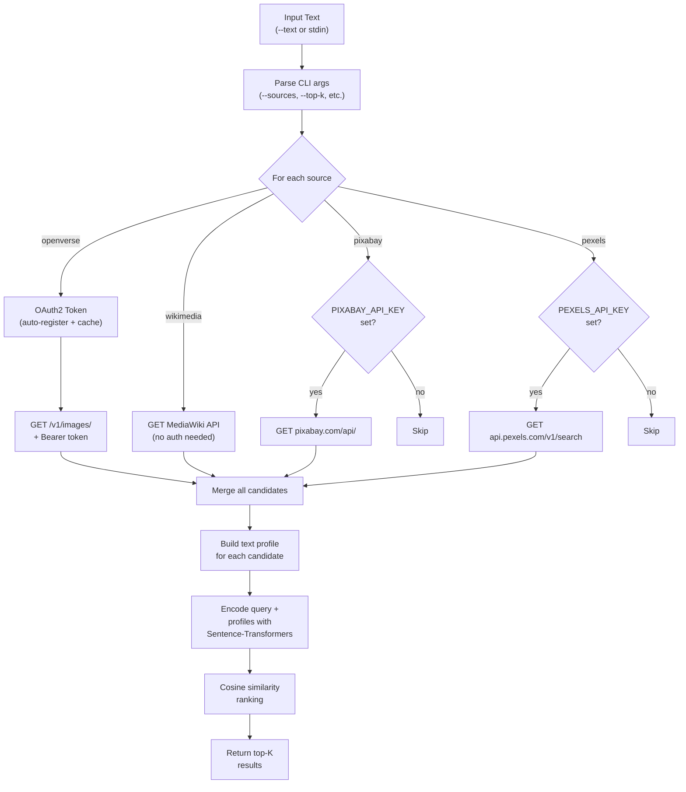

# Semantic Image Fetcher — How It Works

## Overview

This tool finds the **most semantically relevant image** for any text input by searching multiple image APIs and ranking results using AI embeddings + cosine similarity.

```
Input Text → Multi-Source Search → Build Profiles → Embed → Rank → Best Image
```

---

## Step-by-Step Flow

### 1. Input Text

The user provides a text query — this can be an article title, a topic, a summary, or any descriptive text.

```bash
python main.py --text "news on OpenAI" --top-k 5
```

If `--text` is empty, the script reads from stdin (pipe-friendly).

---

### 2. Multi-Source Image Search

The script queries **multiple image APIs in sequence** and merges all results into a single candidate pool.

| Source | Auth | What It Indexes |
|--------|------|-----------------|
| **Openverse** | Auto OAuth2 (registers + caches credentials) | CC0 / Public Domain images (Flickr, Rawpixel, etc.) |
| **Wikimedia Commons** | None needed | Encyclopedic images — logos, people, events, diagrams |
| **Pixabay** | `PIXABAY_API_KEY` env var | High-quality stock photos |
| **Pexels** | `PEXELS_API_KEY` env var | Professional stock photography |

**How each source works:**

- **Openverse**: Registers OAuth2 credentials on first run (saved to `.openverse_creds.json`), obtains a Bearer token, then searches the API.
- **Wikimedia**: Uses the MediaWiki Action API with `generator=search` in the File namespace. Extracts title, description, categories, author, and license from `extmetadata`.
- **Pixabay / Pexels**: Standard REST APIs. Skipped silently if env var keys aren't set.

**Source selection** is controllable via `--sources`:

```bash
--sources openverse,wikimedia     # only these two
--sources wikimedia               # wikimedia only
```

---

### 3. Build Metadata Profiles

For each candidate image, a **text profile** is constructed by concatenating:

```
profile = title + tags + description + creator + provider
```

This profile captures everything we know about the image in plain text. For example:

```
"Car accident insurance photo  car crash vehicle damage  Free stock photo  rawpixel  openverse"
```

This is what gets compared against the user's query — **not** the image pixels themselves.

---

### 4. Embed with Sentence-Transformers

Both the **query text** and all **candidate profiles** are converted to dense vector embeddings using [`all-MiniLM-L6-v2`](https://huggingface.co/sentence-transformers/all-MiniLM-L6-v2):

```python
q_vec  = model.encode([query_text], normalize_embeddings=True)   # shape: (384,)
c_vecs = model.encode(profiles,     normalize_embeddings=True)   # shape: (N, 384)
```

- **Model**: 384-dimensional embeddings, ~22M parameters, fast inference
- **Normalization**: Vectors are L2-normalized so dot product = cosine similarity
- The model is loaded once and cached locally after first download (~80MB)

---

### 5. Cosine Similarity Ranking

Each candidate's similarity to the query is computed:

```python
similarities = np.dot(c_vecs, q_vec)   # (N,) array of scores in [-1, 1]
```

Since vectors are normalized, this is equivalent to:

```
cosine_similarity = cos(θ) = (A · B) / (||A|| × ||B||)
```

- **1.0** = identical meaning
- **0.0** = unrelated
- **-1.0** = opposite meaning

The top-K candidates by score are returned.

---

### 6. Output

Results are printed with score, source attribution, and URLs:

```
============================================================
BEST IMAGE (from wikimedia)
============================================================
  score:    0.4963
  title:    Open Assistant Dashboard
  url:      https://upload.wikimedia.org/...
  source:   https://commons.wikimedia.org/wiki/File:...

============================================================
TOP 5 RESULTS
============================================================
  1. [0.4963] [ wikimedia] Open Assistant Dashboard
  2. [0.4172] [ wikimedia] Performance of open vs closed AI models
  3. [0.3966] [ openverse] The future comes in small packages
  ...
```

Use `--json` for machine-readable output.

---

## Architecture Diagram



---

## Key Design Decisions

| Decision | Rationale |
|----------|-----------|
| **Text-based matching** (not pixel-based) | Much faster, no need for vision models. Metadata is surprisingly rich. |
| **Multiple sources** | Different APIs index different content. Wikimedia has brands/entities, Openverse has stock photos. |
| **Normalized embeddings** | Allows using fast dot product instead of full cosine formula. |
| **Auto-register Openverse** | Zero manual setup — credentials are obtained and cached automatically. |
| **Graceful source skipping** | If Pixabay/Pexels keys aren't set, they're skipped with a message instead of crashing. |
| **`all-MiniLM-L6-v2` model** | Best balance of speed vs quality. Only 80MB, runs on CPU in seconds. |

---

## Typical Scores

| Query Type | Expected Score Range | Why |
|------------|---------------------|-----|
| Descriptive ("red car crashing") | 0.55 – 0.75 | Direct visual match in metadata |
| Topical ("news on OpenAI") | 0.30 – 0.50 | Indirect — relies on tags/categories |
| Abstract ("hope for humanity") | 0.10 – 0.30 | Very loose semantic association |

---

## File Structure

```
f:\imagetest\
├── main.py                    # Main script
├── .openverse_creds.json      # Auto-generated OAuth credentials (gitignore this)
├── logic.md                   # This file
└── results_*.json / .txt      # Output files from test runs
```
