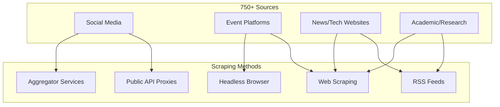
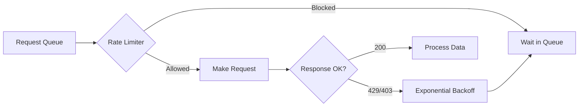

# College Newsletter Platform - Scraping Logic Architecture

> **Version**: 1.0 | **Date**: 31 Jan 2026  
> **Purpose**: Comprehensive scraping strategy for 750+ sources with zero API costs

---

## Table of Contents
1. [Executive Summary](#1-executive-summary)
2. [Source Categories & Strategies](#2-source-categories--strategies)
3. [Platform-Specific Scraping Logic](#3-platform-specific-scraping-logic)
4. [Anti-Detection & Rate Limiting](#4-anti-detection--rate-limiting)
5. [Data Schema & Storage](#5-data-schema--storage)
6. [Orchestration & Automation](#6-orchestration--automation)
7. [Error Handling & Monitoring](#7-error-handling--monitoring)
8. [Scalability Considerations](#8-scalability-considerations)

---

## 1. Executive Summary

### The Challenge
Scrape 750+ sources daily without API access, for free, in a lightweight and fully automated manner.

### The Solution
A **tiered scraping architecture** that uses:
- **RSS/Atom feeds** where available (fastest, most reliable)
- **Headless browser scraping** for JavaScript-heavy sites (Playwright/Selenium)
- **Third-party aggregators** for social media (bypasses direct API restrictions)
- **Proxy rotation** via free services for rate-limit evasion
- **GitHub Actions** for scheduled, serverless execution

### Core Principles
| Principle | Approach |
|-----------|----------|
| **Lightweight** | RSS-first, browser-last |
| **Free** | No paid APIs, use public endpoints & aggregators |
| **Resilient** | Retry logic, fallback methods, alerts on failure |
| **Respectful** | Rate limiting, delays between requests |
| **Automated** | GitHub Actions / n8n, zero manual intervention |

---

## 2. Source Categories & Strategies



### Source Priority Matrix

| Source Type | Estimated Count | Scraping Method | Difficulty | Priority |
|-------------|-----------------|-----------------|------------|----------|
| LinkedIn (profiles/hashtags) | ~100-150 | Aggregator proxies | 🔴 Hard | High |
| Instagram (pages/hashtags) | ~100-150 | Third-party scrapers | 🔴 Hard | High |
| X/Twitter (pages/hashtags) | ~100-150 | Nitter/RSS bridges | 🟡 Medium | High |
| YouTube (keyword search) | ~50-100 | RSS + yt-dlp metadata | 🟢 Easy | High |
| Event Platforms (Unstop, Devfolio, etc.) | ~50-100 | Direct scraping | 🟡 Medium | Critical |
| Tech News Sites | ~100-200 | RSS feeds | 🟢 Easy | Medium |
| College Websites | ~50-100 | Web scraping | 🟡 Medium | Medium |
| Research/Journals | ~50-100 | RSS/OAI-PMH | 🟢 Easy | Low |

---

## 3. Platform-Specific Scraping Logic

### 3.1 LinkedIn Scraping

> [!CAUTION]
> LinkedIn has aggressive anti-bot measures. Direct scraping is risky and accounts get banned.

#### Strategy: Use Third-Party Proxy Services

**Option A: Google Search Scraping (Recommended)**
```
Flow: Google Search → "site:linkedin.com/in/ {keyword}" → Parse results
```
- Search Google with `site:linkedin.com/in/ {hashtag/keyword}`
- Extract profile URLs and snippets from search results
- Pros: Free, works reliably
- Cons: Limited depth, only public snippet

**Option B: Bing News API Alternative**
- Use Bing's web search for LinkedIn mentions
- Free tier available (limited requests)

**Option C: LinkedIn RSS via Third-Party**
- Services like `rss.app` can generate RSS feeds from LinkedIn profiles
- Free tier: Limited profiles

**Option D: Proxycurl Alternative - Public Profile Scraping**
- Scrape LinkedIn public profiles via Selenium with:
  - Rotating residential proxies (free tier from services like ScraperAPI free trial)
  - Cookie rotation
  - Human-like delays (5-15 seconds between requests)

#### LinkedIn Data to Extract
| Field | Source |
|-------|--------|
| Post text | Google snippet / profile scrape |
| Author name | Profile URL parse |
| Post date | Snippet parsing |
| Engagement (likes/comments) | Not available without login |
| Hashtags | Text parsing |

#### Recommended Approach for LinkedIn
1. **Primary**: Google search scraping for hashtags/keywords
2. **Secondary**: RSS.app for top 20-30 key profiles
3. **Tertiary**: Manual Selenium scraping (last resort, high ban risk)

---

### 3.2 Instagram Scraping

> [!CAUTION]
> Instagram heavily rate-limits and blocks scrapers. Never use logged-in sessions.

#### Strategy: Use Anonymous Public Endpoints + Third-Party Tools

**Option A: Instaloader (Recommended)**
```
Tool: Instaloader (Python library)
Mode: Anonymous (no login)
Capability: Public profiles, posts, hashtags
Limit: ~200 requests before soft-block (reset in 24h)
```
- Works on public profiles only
- Can fetch recent posts, captions, timestamps
- Rate limit: Add 30-60 second delays between accounts

**Option B: Instagram GraphQL Endpoints**
```
Endpoint: https://www.instagram.com/{username}/?__a=1&__d=dis
Alt Endpoint: https://i.instagram.com/api/v1/users/web_profile_info/?username={username}
```
- Public JSON endpoints (no auth required)
- May break with Instagram updates

**Option C: Apify Free Tier**
- Apify has Instagram scrapers with free tier (~100 pages/month)
- Good for critical accounts

**Option D: JESGOO / Google Images**
- Search Google Images with `site:instagram.com {hashtag}`
- Extract post URLs from results

#### Instagram Data to Extract
| Field | Availability |
|-------|--------------|
| Post caption | ✅ Public |
| Post image URL | ✅ Public |
| Post date | ✅ Public |
| Likes/comments count | ⚠️ Sometimes hidden |
| Profile bio | ✅ Public |
| Hashtags | ✅ From caption |

#### Recommended Approach for Instagram
1. **Primary**: Instaloader for top 50-100 accounts (with delays)
2. **Secondary**: GraphQL endpoints for backup
3. **Hashtag discovery**: Google search `site:instagram.com #hashtag`

---

### 3.3 X (Twitter) Scraping

> [!WARNING]
> Twitter/X API is now paid-only. Use these alternatives.

#### Strategy: Nitter + RSS Bridges

**Option A: Nitter Instances (Recommended)**
```
What: Open-source Twitter frontend
Benefit: Provides RSS feeds for any profile/search
Example: https://nitter.net/{username}/rss
```

**List of Working Nitter Instances:**
- `nitter.net` (main, may be rate-limited)
- `nitter.privacydev.net`
- `nitter.poast.org`
- `nitter.1d4.us`
- [Full list](https://github.com/zedeus/nitter/wiki/Instances)

**How to Use:**
| Content Type | Nitter URL Format |
|--------------|-------------------|
| User timeline | `https://{nitter-instance}/{username}/rss` |
| User's tweets only | `https://{nitter-instance}/{username}/rss?exclude_replies=true` |
| Hashtag/Search | `https://{nitter-instance}/search/rss?f=tweets&q={query}` |

**Option B: RSS.app / RSS Bridge**
- Use [RSSHub](https://docs.rsshub.app/) or RSS.app to create feeds from Twitter
- Free tier sufficient for 50-100 accounts

**Option C: snscrape (Python - Direct Scraping)**
```
Tool: snscrape
Mode: No login required
Data: Tweets, profiles, hashtags
Status: May break with X updates
```

**Option D: Playwright Direct Scraping**
- Headless browser scraping of x.com
- Requires proxy rotation
- Last resort due to complexity

#### X/Twitter Data to Extract
| Field | Source |
|-------|--------|
| Tweet text | Nitter RSS / snscrape |
| Author | RSS / snscrape |
| Timestamp | RSS / snscrape |
| Retweets/Likes | Limited in RSS, available in snscrape |
| Hashtags | Text parsing |
| URLs in tweet | RSS enclosures |

#### Recommended Approach for X/Twitter
1. **Primary**: Nitter RSS feeds (rotate instances)
2. **Secondary**: snscrape for hashtag searches
3. **Fallback**: RSSHub/RSS.app bridges

---

### 3.4 YouTube Scraping

> [!TIP]
> YouTube is the **easiest** platform to scrape for free.

#### Strategy: RSS Feeds + yt-dlp Metadata

**Option A: YouTube RSS Feeds (Recommended)**
```
Channel RSS: https://www.youtube.com/feeds/videos.xml?channel_id={CHANNEL_ID}
Playlist RSS: https://www.youtube.com/feeds/videos.xml?playlist_id={PLAYLIST_ID}
```
- Native YouTube feature
- Returns last 15 videos per channel
- No rate limits
- Includes: title, description, publish date, thumbnail, video ID

**Option B: yt-dlp for Search Results**
```
Tool: yt-dlp (Python wrapper: yt-dlp)
Usage: yt-dlp --dump-json "ytsearch20:{keyword}"
Data: Full metadata without downloading video
```
- Search by keyword, get top N results
- Extract: title, description, views, likes, channel, duration
- Free and reliable

**Option C: YouTube Data API Free Tier**
- 10,000 units/day free
- 100 units per search = 100 searches/day
- Use only for keyword searches, not channel monitoring

#### YouTube Data to Extract
| Field | RSS | yt-dlp |
|-------|-----|--------|
| Title | ✅ | ✅ |
| Description | ✅ | ✅ |
| Publish date | ✅ | ✅ |
| Channel name | ✅ | ✅ |
| Thumbnail | ✅ | ✅ |
| Views/Likes | ❌ | ✅ |
| Duration | ❌ | ✅ |

#### Recommended Approach for YouTube
1. **Channel monitoring**: RSS feeds (unlimited, fast)
2. **Keyword search**: yt-dlp with `ytsearch` prefix
3. **Metadata enrichment**: yt-dlp for individual videos if needed

---

### 3.5 Event Platforms Scraping

> [!IMPORTANT]
> Event platforms are **critical** for opportunities, workshops, and hackathons.

#### Target Platforms
| Platform | URL | Scraping Method |
|----------|-----|-----------------|
| Unstop | unstop.com | REST API + Playwright |
| Devfolio | devfolio.co | GraphQL API |
| Hackerearth | hackerearth.com | Public API |
| D2C | dare2compete.com | Same as Unstop |
| Internshala | internshala.com | Web scraping |
| LinkedIn Events | linkedin.com/events | Google search |
| Eventbrite | eventbrite.com | REST API |
| Meetup | meetup.com | GraphQL API |

#### Unstop / D2C Scraping
```
API Endpoint: https://unstop.com/api/public/opportunity/search-result
Method: POST
Payload: {"filters": {...}, "page": 1, "size": 20}
```
- Public API, no authentication
- Returns JSON with full event details
- Paginate through results

#### Devfolio Scraping
```
API Endpoint: GraphQL at devfolio.co
Query: hackathons, upcoming events
```
- GraphQL introspection to discover schema
- Fetch hackathon listings

#### Hackerearth
```
Listing Page: hackerearth.com/challenges/
Method: BeautifulSoup / Playwright
```
- Standard web scraping
- Extract: name, dates, prize, eligibility

#### Event Data to Extract
| Field | Required |
|-------|----------|
| Event name | ✅ |
| Organizer | ✅ |
| Start/End dates | ✅ |
| Registration deadline | ✅ |
| Prize/Stipend | ✅ |
| Eligibility | ✅ |
| Mode (Online/Offline) | ✅ |
| URL | ✅ |
| Tags/Categories | ✅ |

---

### 3.6 News & Tech Websites

#### Strategy: RSS-First, Scrape-Second

**Tier 1: RSS Feeds Available**
- TechCrunch, Wired, The Verge, Ars Technica
- Indian: YourStory, Inc42, Economic Times Tech
- Just parse RSS feeds - fast and reliable

**Tier 2: No RSS, Simple HTML**
- Use `requests` + `BeautifulSoup`
- Extract headlines, dates, links from homepage
- Example: College placement pages, local news

**Tier 3: JavaScript-Heavy Sites**
- Use `playwright` in headless mode
- Wait for content to load, then extract
- Example: Some modern news portals

#### News Data to Extract
| Field | Required |
|-------|----------|
| Headline | ✅ |
| Summary/Excerpt | ✅ |
| Source URL | ✅ |
| Publish date | ✅ |
| Author | ⚠️ Optional |
| Category | ⚠️ Optional |
| Image URL | ⚠️ Optional |

---

### 3.7 Academic & Research Sources

#### Strategy: Leverage Open Access Protocols

**arXiv**
```
RSS: https://arxiv.org/rss/{category}
API: https://export.arxiv.org/api/query?search_query={query}
```
- Free API, no rate limits (be respectful)
- Categories: cs.AI, cs.LG, stat.ML, etc.

**Google Scholar**
- No official API
- Use: `scholarly` Python library
- Caution: Heavy rate limiting

**ResearchGate**
- Scrape public profile pages
- No API available

**PubMed / Semantic Scholar**
- Free APIs available
- Good for medical/life sciences

**OpenAlex**
```
API: https://api.openalex.org/works?search={query}
```
- Free, no auth required
- Comprehensive academic database

---

## 4. Anti-Detection & Rate Limiting

### Rate Limiting Strategy



### Delays by Platform
| Platform | Delay Between Requests | Daily Limit |
|----------|------------------------|-------------|
| LinkedIn (via Google) | 5-10 seconds | ~500 searches |
| Instagram | 30-60 seconds | ~200 profiles |
| X (Nitter) | 1-2 seconds | ~1000 feeds |
| YouTube (RSS) | No delay needed | Unlimited |
| Event Platforms | 2-5 seconds | ~500 requests |
| News Sites | 1-2 seconds | ~1000 pages |

### Free Proxy Options
| Service | Free Tier | Use Case |
|---------|-----------|----------|
| ScraperAPI | 5,000 credits trial | LinkedIn/Instagram |
| Bright Data | Trial available | Heavy lifting |
| Free-Proxy-List | Unlimited (unreliable) | Basic sites |
| Tor Network | Free | Last resort |

### Headers & Fingerprinting
```
Rotate User-Agents: Use fake-useragent library
Headers: Accept-Language, Referer, Accept-Encoding
Cookies: Clear between sessions
Browser: Use undetected-chromedriver for Playwright
```

---

## 5. Data Schema & Storage

### Recommended Database: **PostgreSQL + Redis**

| Component | Purpose |
|-----------|---------|
| PostgreSQL | Primary storage, relational queries, full-text search |
| Redis | URL deduplication cache, rate-limit tracking, job queues |

> [!TIP]
> For a free hosted option: **Supabase** (PostgreSQL) + **Upstash** (Redis) both have generous free tiers.

### Core Tables Schema

```
┌─────────────────────────────────────────────────────────────┐
│                         sources                              │
├─────────────────────────────────────────────────────────────┤
│ id (PK)          │ UUID                                     │
│ name             │ VARCHAR(255)                             │
│ platform         │ ENUM(linkedin, instagram, x, youtube,    │
│                  │       event, news, academic)              │
│ source_type      │ ENUM(profile, hashtag, keyword, rss, api)│
│ identifier       │ VARCHAR(500) - URL/handle/hashtag        │
│ scrape_method    │ VARCHAR(50)                              │
│ priority         │ INTEGER (1-10)                           │
│ last_scraped     │ TIMESTAMP                                │
│ status           │ ENUM(active, paused, failed)             │
│ error_count      │ INTEGER                                  │
│ created_at       │ TIMESTAMP                                │
└─────────────────────────────────────────────────────────────┘

┌─────────────────────────────────────────────────────────────┐
│                        raw_content                           │
├─────────────────────────────────────────────────────────────┤
│ id (PK)          │ UUID                                     │
│ source_id (FK)   │ UUID → sources.id                        │
│ content_hash     │ VARCHAR(64) - SHA256 for dedup           │
│ url              │ TEXT                                     │
│ title            │ TEXT                                     │
│ raw_text         │ TEXT                                     │
│ author           │ VARCHAR(255)                             │
│ published_at     │ TIMESTAMP                                │
│ scraped_at       │ TIMESTAMP                                │
│ platform         │ VARCHAR(50)                              │
│ metadata         │ JSONB - platform-specific data           │
│ status           │ ENUM(raw, cleaned, classified, published)│
└─────────────────────────────────────────────────────────────┘

┌─────────────────────────────────────────────────────────────┐
│                      processed_content                       │
├─────────────────────────────────────────────────────────────┤
│ id (PK)          │ UUID                                     │
│ raw_content_id   │ UUID → raw_content.id                    │
│ headline         │ VARCHAR(200)                             │
│ summary          │ TEXT - 2-3 minute read format            │
│ department       │ VARCHAR(100)                             │
│ category         │ ENUM(trend, job, story, skill, event)    │
│ priority_score   │ FLOAT                                    │
│ weekly_bucket    │ VARCHAR(10) - YYYY-W##                   │
│ is_published     │ BOOLEAN                                  │
│ created_at       │ TIMESTAMP                                │
└─────────────────────────────────────────────────────────────┘

┌─────────────────────────────────────────────────────────────┐
│                         events                               │
├─────────────────────────────────────────────────────────────┤
│ id (PK)          │ UUID                                     │
│ raw_content_id   │ UUID → raw_content.id                    │
│ name             │ VARCHAR(500)                             │
│ organizer        │ VARCHAR(255)                             │
│ platform         │ VARCHAR(50) - unstop, devfolio, etc.     │
│ start_date       │ DATE                                     │
│ end_date         │ DATE                                     │
│ registration_end │ TIMESTAMP                                │
│ mode             │ ENUM(online, offline, hybrid)            │
│ prize            │ VARCHAR(100)                             │
│ eligibility      │ TEXT                                     │
│ url              │ TEXT                                     │
│ tags             │ TEXT[]                                   │
│ status           │ ENUM(upcoming, live, ended)              │
└─────────────────────────────────────────────────────────────┘

┌─────────────────────────────────────────────────────────────┐
│                      scrape_logs                             │
├─────────────────────────────────────────────────────────────┤
│ id (PK)          │ UUID                                     │
│ source_id (FK)   │ UUID → sources.id                        │
│ started_at       │ TIMESTAMP                                │
│ completed_at     │ TIMESTAMP                                │
│ items_found      │ INTEGER                                  │
│ items_new        │ INTEGER                                  │
│ status           │ ENUM(success, partial, failed)           │
│ error_message    │ TEXT                                     │
└─────────────────────────────────────────────────────────────┘
```

### Redis Keys Structure
```
dedup:urls         → SET of content_hash values (TTL: 30 days)
ratelimit:{domain} → Counter with TTL for rate limiting
queue:scrape       → List of source_ids to scrape
failed:{source_id} → Error count and timestamps
```

---

## 6. Orchestration & Automation

### Option A: GitHub Actions (Recommended for Free)

```
┌────────────────────────────────────────────────────────────┐
│                    GitHub Actions Workflow                  │
├────────────────────────────────────────────────────────────┤
│                                                             │
│  ┌─────────────┐    ┌─────────────┐    ┌─────────────┐    │
│  │  Schedule   │───▶│   Scrape    │───▶│   Process   │    │
│  │  (Cron)     │    │   Job       │    │   Job       │    │
│  └─────────────┘    └─────────────┘    └─────────────┘    │
│                            │                   │           │
│                            ▼                   ▼           │
│                     ┌─────────────┐    ┌─────────────┐    │
│                     │  Database   │    │   Notify    │    │
│                     │  (Supabase) │    │   (Slack)   │    │
│                     └─────────────┘    └─────────────┘    │
│                                                             │
└────────────────────────────────────────────────────────────┘
```

**Workflow Structure:**
```yaml
# Conceptual structure (not code, just logic)

Schedule: Every day at 6:00 AM IST

Jobs:
  1. Scrape Social Media (Matrix: LinkedIn, Instagram, X, YouTube)
     - Timeout: 3 hours
     - Parallel: 4 runners
     
  2. Scrape Event Platforms (After Job 1)
     - Timeout: 1 hour
     
  3. Scrape News & Academic (After Job 1)
     - Timeout: 1 hour
     
  4. Process & Classify (After Jobs 2, 3)
     - Deduplicate
     - Classify by department
     - Generate summaries
     
  5. Notify & Report (After Job 4)
     - Slack/Discord notification
     - Daily stats to dashboard
```

**GitHub Actions Limits:**
| Limit | Value |
|-------|-------|
| Job timeout | 6 hours |
| Workflow timeout | 72 hours |
| Concurrent jobs | 20 (free) |
| Monthly minutes | 2,000 (free) |

**Optimization: Split by Platform**
- Run 4 parallel workflows, one per platform
- Each workflow handles its sources
- Reduces timeout risk

---

### Option B: n8n (Self-Hosted)

```
┌──────────────────────────────────────────────────────────────┐
│                       n8n Workflow                            │
├──────────────────────────────────────────────────────────────┤
│                                                               │
│   ┌─────────┐   ┌─────────┐   ┌─────────┐   ┌─────────┐     │
│   │ Cron    │──▶│ Fetch   │──▶│ Scraper │──▶│ Filter  │     │
│   │ Trigger │   │ Sources │   │ (HTTP)  │   │ New     │     │
│   └─────────┘   └─────────┘   └─────────┘   └─────────┘     │
│                                                    │          │
│                                                    ▼          │
│   ┌─────────┐   ┌─────────┐   ┌─────────┐   ┌─────────┐     │
│   │ Alert   │◀──│ Log     │◀──│ Save    │◀──│ Process │     │
│   │         │   │         │   │ to DB   │   │         │     │
│   └─────────┘   └─────────┘   └─────────┘   └─────────┘     │
│                                                               │
└──────────────────────────────────────────────────────────────┘
```

**Pros:**
- Visual workflow builder
- Easy to modify and debug
- Built-in error handling
- Can host on Railway/Render (free tier)

**Cons:**
- Needs a server running 24/7
- Memory limits on free hosting

---

### Hybrid Approach (Recommended)

```
GitHub Actions          n8n (on Railway)
     │                        │
     │ Triggers daily         │ Long-running scrapers
     │ Short tasks            │ Playwright jobs
     │ RSS parsing            │ Instagram/LinkedIn
     │                        │
     └──────────┬─────────────┘
                │
                ▼
        ┌──────────────┐
        │   Supabase   │
        │   Database   │
        └──────────────┘
```

- **GitHub Actions**: Handle RSS feeds, YouTube, news sites (fast, simple)
- **n8n on Railway**: Handle browser-based scraping (LinkedIn, Instagram)
- **Both write to**: Supabase PostgreSQL

---

## 7. Error Handling & Monitoring

### Error Categories

| Error Type | Example | Action |
|------------|---------|--------|
| Rate Limited (429) | Instagram block | Exponential backoff, try next day |
| Content Changed (Parse Error) | HTML structure changed | Alert, mark source for review |
| Network Error | Timeout, DNS failure | Retry 3x with delay |
| Authentication Required | Login wall | Mark source as failed, alert |
| Source Deprecated | Domain expired | Mark inactive |

### Retry Logic

```
Attempt 1: Immediate
Attempt 2: Wait 30 seconds
Attempt 3: Wait 2 minutes
Attempt 4: Wait 10 minutes
After 4 failures: Mark source as FAILED, send alert
```

### Monitoring Dashboard

**Metrics to Track:**
| Metric | Purpose |
|--------|---------|
| Sources scraped today | Overall health |
| Success rate by platform | Identify problem platforms |
| New content count | Content pipeline health |
| Duplicates filtered | Dedup effectiveness |
| Failed sources | Requires attention |
| Avg scrape time | Performance tracking |

**Alerting:**
- **Slack/Discord webhook**: On failures, daily summary
- **Email**: Weekly report, critical failures

---

## 8. Scalability Considerations

### Current Design: 750 Sources

| Resource | Estimation |
|----------|------------|
| Database size | ~1GB/month |
| Scrape time | 2-4 hours/day |
| GitHub Actions minutes | ~1,000/month |
| n8n memory | 512MB |

### Scaling to 2000+ Sources

**Strategy:**
1. **Shard by platform**: Separate workflows per platform
2. **Priority queuing**: Scrape high-priority sources first
3. **Incremental scraping**: Only fetch changed content
4. **Distributed workers**: Multiple n8n instances

### Future Optimizations

| Optimization | Benefit |
|--------------|---------|
| Content hashing | Faster deduplication |
| Conditional requests (ETag/If-Modified-Since) | Reduce bandwidth |
| Compressed storage | Lower DB costs |
| Edge caching | Faster content delivery |

---

## Appendix A: Tool/Library Recommendations

| Purpose | Recommended Tool | Alternative |
|---------|------------------|-------------|
| HTTP Requests | `httpx` (async) | `requests` |
| HTML Parsing | `BeautifulSoup4` | `lxml`, `selectolax` |
| Browser Automation | `playwright` | `selenium` |
| RSS Parsing | `feedparser` | `atoma` |
| YouTube Metadata | `yt-dlp` | YouTube API |
| Instagram | `instaloader` | `instagram-scraper` |
| Twitter/X | `snscrape` | Nitter RSS |
| Rate Limiting | `ratelimit` library | Custom with Redis |
| Proxy Rotation | `rotating-free-proxies` | ScraperAPI |
| Database ORM | `SQLAlchemy` | `Prisma` |
| Task Queue | `Celery` | `RQ`, `Dramatiq` |
| Scheduling | `APScheduler` | GitHub Actions cron |

---

## Appendix B: Daily Scrape Execution Order

```
06:00 AM - Start
    │
    ├── [PARALLEL] RSS Feeds (News, YouTube, arXiv)
    │   └── ~500 sources in 15 minutes
    │
    ├── [PARALLEL] Event Platforms (Unstop, Devfolio, etc.)
    │   └── ~100 sources in 30 minutes
    │
    ├── [SEQUENTIAL] X/Twitter via Nitter
    │   └── ~150 sources in 1 hour (rate limited)
    │
    ├── [SEQUENTIAL] Instagram via Instaloader
    │   └── ~100 sources in 2 hours (heavy rate limits)
    │
    ├── [SEQUENTIAL] LinkedIn via Google Search
    │   └── ~100 searches in 45 minutes
    │
09:30 AM - All scraping complete
    │
    ├── Deduplication pass
    ├── Classification and tagging
    ├── Summary generation (AI)
    │
11:00 AM - Content ready for review
    │
    └── Daily report sent
```

---

## Appendix C: Risk Assessment

| Risk | Probability | Impact | Mitigation |
|------|-------------|--------|------------|
| Instagram IP ban | High | Medium | Rotate proxies, aggressive delays |
| LinkedIn account ban | High | High | Never use logged-in scraping |
| Nitter instances down | Medium | Low | Maintain list of 5+ fallback instances |
| GitHub Actions limits | Low | High | Split workflows, optimize runtime |
| Database costs | Low | Medium | Use Supabase free tier, optimize queries |
| Parsing failures | Medium | Low | Robust error handling, alerts |

---

## Summary

This architecture provides a **free, lightweight, and scalable** solution for scraping 750+ sources daily. The key strategies are:

1. **RSS-first**: ~60% of sources can use RSS (fast, reliable)
2. **Third-party proxies**: LinkedIn and Instagram via Google/aggregators
3. **Nitter for X**: Free RSS bridge, no API needed
4. **YouTube RSS + yt-dlp**: Completely free, no limits
5. **Direct scraping for events**: Public APIs where available
6. **GitHub Actions + n8n**: Free orchestration
7. **Supabase + Upstash**: Free database hosting

> [!IMPORTANT]
> **Next Steps:**
> 1. Review and approve this architecture
> 2. Get the source list from the team
> 3. Begin implementation of scrapers by platform
> 4. Set up database and orchestration
> 5. Build the processing pipeline (dedupe, classify, summarize)
