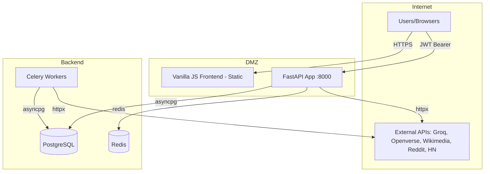

# NEWS DAY — Production Readiness Audit + Scale Validation Plan

> **Verdict: 🔴 NOT READY FOR PRODUCTION**
> 2 P0 security blockers, 3 P0 reliability blockers. See [Section K](#k-final-verdict).

---

## A) Codebase Classification

| Attribute | Value |
|---|---|
| **Type** | Content aggregation pipeline + AI processing + user-facing feed API |
| **Stack** | FastAPI 0.109 · SQLAlchemy 2.0 (async/pg) · PostgreSQL · Celery/Redis · sentence-transformers · Vanilla JS |
| **Architecture** | Monolith: Scrapers → [raw_content](file:///f:/newsletter/Newsletter/backend/app/services/scraper_service.py#322-358) → AI Processing → `processed_content` → Feed Cache → API → Frontend |
| **AI Risk** | 🔴 HIGH — multiple vibe-coded patterns (see findings) |
| **Scale Target** | 5K–50K college users, 200+ sources, 10 departments |
| **Code Volume** | ~5,500 lines backend Python, ~310K lines frontend |

---

## B) Critical User/Business Flows

| # | Flow | Entry Point | Criticality |
|---|---|---|---|
| 1 | **Homepage feed** | `GET /api/v1/feed/all-sections` | 🔴 P0 — primary UX |
| 2 | **Scrape→Process→Cache pipeline** | Celery beat schedule | 🔴 P0 — data freshness |
| 3 | **Breaking news detection** | `ContentProcessor._is_breaking_candidate` | 🟡 P1 — trust |
| 4 | **User registration + login** | `POST /auth/register`, `/auth/login` | 🟡 P1 — access control |
| 5 | **AI summarization** | Groq → FreeAI → Mock fallback | 🟡 P1 — content quality |
| 6 | **Search** | `GET /feed/search?q=` | 🟢 P2 |

---

## C) Trust Boundaries and Attack Surface

**Trust boundaries:** Browser→API (JWT), API→DB (connection string), API→External APIs (API keys), Celery→DB (shared engine)

---

## D) Security Findings

### D1 — 🔴 CRITICAL: Mass Assignment → Privilege Escalation

| Field | Value |
|---|---|
| **Severity** | Critical |
| **Category** | Broken Access Control (BOLA) |
| **Location** | [auth_service.py:87-88](file:///f:/newsletter/Newsletter/backend/app/services/auth_service.py#L87-L88) |
| **Evidence** | `for field, value in update_data.items(): setattr(user, field, value)` — iterates over ALL fields from [UserUpdate](file:///f:/newsletter/Newsletter/backend/app/schemas/user.py#29-39) and sets them directly on the ORM model |
| **Exploit** | `PUT /api/v1/auth/me` with body `{"is_admin": true}` — [UserUpdate](file:///f:/newsletter/Newsletter/backend/app/schemas/user.py#29-39) doesn't exclude `is_admin`, and `setattr` applies it directly to the User model. Attacker escalates to admin. |
| **Impact** | Any authenticated user becomes admin, accessing all scraper controls and `/dev/refresh` |
| **Remediation** | Whitelist allowed fields in [update_user()](file:///f:/newsletter/Newsletter/backend/app/services/auth_service.py#77-94): `ALLOWED_FIELDS = {"full_name", "department", "year_of_study", ...}`. Filter `update_data` before `setattr`. |
| **Test** | `test_update_user_cannot_set_is_admin`, `test_update_user_cannot_set_is_active` |

### D2 — 🔴 CRITICAL: Unauthenticated Data Deletion Endpoint

| Field | Value |
|---|---|
| **Severity** | Critical |
| **Category** | Broken Access Control |
| **Location** | [scrapers.py:227-257](file:///f:/newsletter/Newsletter/backend/app/api/v1/scrapers.py#L227-L257) |
| **Evidence** | `/dev/refresh` has **no auth dependency**. Guard `getattr(settings, 'DEBUG', True)` defaults to `True` if `.env` is missing |
| **Exploit** | `GET /api/v1/scrapers/dev/refresh` → deletes ALL `processed_content`, resets all [raw_content](file:///f:/newsletter/Newsletter/backend/app/services/scraper_service.py#322-358) to pending |
| **Impact** | Complete data loss, service outage |
| **Remediation** | (1) Change default to `False`. (2) Add [get_current_admin_user](file:///f:/newsletter/Newsletter/backend/app/api/deps.py#82-92) dependency. (3) Add `if not settings.DEBUG: raise HTTPException(403)` |
| **Test** | `test_dev_refresh_blocked_when_debug_false`, `test_dev_refresh_requires_admin` |

### D3 — 🟡 HIGH: No Token Revocation (Stateless Logout)

| Field | Value |
|---|---|
| **Severity** | High |
| **Category** | Authentication Flaw |
| **Location** | [auth.py:207-217](file:///f:/newsletter/Newsletter/backend/app/api/v1/auth.py#L207-L217) |
| **Evidence** | Logout returns success but tokens remain valid until expiry (30min access, 7 days refresh) |
| **Exploit** | Stolen token remains usable after user "logs out" |
| **Remediation** | Redis token blacklist, checked in [get_current_user](file:///f:/newsletter/Newsletter/backend/app/api/deps.py#20-68) dependency |

### D4 — 🟡 HIGH: LIKE-based Search Without Sanitization

| Field | Value |
|---|---|
| **Severity** | High |
| **Category** | SQL Injection Risk |
| **Location** | [feed.py:89](file:///f:/newsletter/Newsletter/backend/app/api/v1/feed.py#L89) |
| **Evidence** | `search_term = f"%{q.lower()}%"` — `%` and `_` in user input are SQL LIKE wildcards. Not injection per se (parameterized), but allows wildcard abuse: `q=%%%` forces full table scan |
| **Impact** | DoS via expensive full-table LIKE scans |
| **Remediation** | Escape `%` and `_` in query: `q.replace('%', '\\%').replace('_', '\\_')`. Consider full-text search (`tsvector`) |

### D5 — 🟡 HIGH: SSRF via Image Fetcher

| Field | Value |
|---|---|
| **Severity** | High |
| **Category** | SSRF |
| **Location** | [image_fetcher.py:297-328](file:///f:/newsletter/Newsletter/backend/app/services/image_fetcher.py#L297-L328) |
| **Evidence** | Image URLs from Openverse/Wikimedia are stored in `featured_image_url` and served to frontend. If upstream returns `http://169.254.169.254/...` (cloud metadata) or `file:///etc/passwd`, the URL is stored as-is |
| **Remediation** | Validate image URLs: must be `https://`, not private IP ranges, must end in image extension or return image MIME |

### D6 — 🟡 MEDIUM: Openverse Credentials Stored as Plaintext

| Field | Value |
|---|---|
| **Severity** | Medium |
| **Category** | Secrets Exposure |
| **Location** | [image_fetcher.py:291-295](file:///f:/newsletter/Newsletter/backend/app/services/image_fetcher.py#L291-L295) |
| **Evidence** | `CREDS_PATH.write_text(json.dumps(creds))` — client_id/secret written to `.openverse_creds.json` in project root |
| **Remediation** | Store in `.env` or encrypted vault, not flat file |

### D7 — 🟡 MEDIUM: No CSRF Protection on State-Changing POST Endpoints

| Field | Value |
|---|---|
| **Severity** | Medium |
| **Category** | CSRF |
| **Location** | All POST endpoints (save, feedback, read, password change) |
| **Evidence** | JWT Bearer auth protects against CSRF if tokens are in `Authorization` header (not cookies). **But** `allow_credentials=True` in CORS means if tokens are ever stored in cookies, CSRF becomes exploitable |
| **Remediation** | Ensure tokens are never cookie-stored, or add `SameSite=Strict` |

### D8 — 🟢 LOW: `datetime.utcnow()` Deprecated

| Field | Value |
|---|---|
| **Location** | [security.py:39,41,66](file:///f:/newsletter/Newsletter/backend/app/core/security.py#L39-L66), [auth_service.py:72](file:///f:/newsletter/Newsletter/backend/app/services/auth_service.py#L72), [scraper_service.py:157-158](file:///f:/newsletter/Newsletter/backend/app/services/scraper_service.py#L157-L158) |
| **Evidence** | `datetime.utcnow()` deprecated since Python 3.12, returns naive datetime |
| **Remediation** | Replace with `datetime.now(timezone.utc)` everywhere |

### D9 — 🟢 LOW: Content Hash Truncation → Collision Risk

| Field | Value |
|---|---|
| **Location** | [scraper_service.py:327](file:///f:/newsletter/Newsletter/backend/app/services/scraper_service.py#L327) |
| **Evidence** | `hashlib.sha256(...).hexdigest()[:32]` — 128-bit hash. Birthday paradox: ~50% collision at ~2^64 items (safe). But hash input `title+url+author` not `url` alone — two articles with same URL but different authors get different hashes (dedup failure) |
| **Remediation** | Hash on `url` only for dedup. Keep full 64-char hex |

---

## E) Reliability / Scalability / Performance Findings

### E1 — 🔴 CRITICAL: Per-Request Object + Connection Instantiation

| Field | Value |
|---|---|
| **Risk** | [AIProvider()](file:///f:/newsletter/Newsletter/backend/app/integrations/ai_provider.py#8-98), [GroqService()](file:///f:/newsletter/Newsletter/backend/app/integrations/groq_service.py#12-480), `httpx.AsyncClient()`, [ImageFetcher()](file:///f:/newsletter/Newsletter/backend/app/services/image_fetcher.py#65-443), `SentenceTransformer()` created per request/per item |
| **Where** | content_processor.py:21, vector_service.py:24, image_fetcher.py:298,333,390,420 |
| **Why in prod** | Each [ContentProcessor(db)](file:///f:/newsletter/Newsletter/backend/app/services/content_processor.py#16-591) creates [AIProvider()](file:///f:/newsletter/Newsletter/backend/app/integrations/ai_provider.py#8-98) → [GroqService()](file:///f:/newsletter/Newsletter/backend/app/integrations/groq_service.py#12-480) → `httpx.AsyncClient()`. Each `ImageFetcher._search_*()` creates a **new** `httpx.AsyncClient()`. Processing 50 items = ~200 client instances |
| **Trigger** | >10 concurrent processing requests |
| **Signal** | Open file descriptors spike, `ConnectionError`, `OSError: too many open files` |
| **Validation** | `lsof -p <pid> | wc -l` during processing; profile FD count |
| **Mitigation** | Singleton `httpx.AsyncClient` at module level with connection pooling. Singleton [AIProvider](file:///f:/newsletter/Newsletter/backend/app/integrations/ai_provider.py#8-98). Pass [ImageFetcher](file:///f:/newsletter/Newsletter/backend/app/services/image_fetcher.py#65-443) shared client |

### E2 — 🔴 CRITICAL: In-Memory Sort of 200 DB Rows Per Breaking News Call

| Field | Value |
|---|---|
| **Risk** | [get_breaking_news](file:///f:/newsletter/Newsletter/backend/app/services/feed_service.py#152-266) loads 200 rows, then sorts in Python with a lambda |
| **Where** | [feed_service.py:172-224](file:///f:/newsletter/Newsletter/backend/app/services/feed_service.py#L172-L224) |
| **Why in prod** | 50 concurrent users hitting `/all-sections` = 50 × 200 ORM hydrations + 50 Python sorts. Each ORM object includes JSONB `content_blocks` |
| **Signal** | p99 latency spike on `/all-sections`, CPU spikes |
| **Validation** | Load test: 50 concurrent `/all-sections` requests, measure p99 |
| **Mitigation** | SQL-level scoring with `CASE WHEN` + `ORDER BY` + `LIMIT`. Or precompute breaking scores into a column and query with `ORDER BY breaking_score DESC LIMIT 5` |

### E3 — 🔴 CRITICAL: `max_overflow=0` Hard-Blocks on Pool Exhaustion

| Field | Value |
|---|---|
| **Risk** | `create_async_engine(..., max_overflow=0)` — when all 20 connections are in use, the 21st request **blocks indefinitely** (no timeout configured) |
| **Where** | [base.py:47-52](file:///f:/newsletter/Newsletter/backend/app/models/base.py#L47-L52) |
| **Why in prod** | During scraper runs (which hold DB sessions for extended periods), API requests queue up. With 20 connections and 6 scrapers + Celery workers sharing the same pool, pool exhaustion is likely |
| **Signal** | Request latency jumps to 30s+, then timeout. Health check still passes (doesn't test DB) |
| **Validation** | Simulate: run all scrapers while sending 30 concurrent API requests |
| **Mitigation** | Set `max_overflow=10`, add `pool_timeout=10` (seconds), add DB health check |

### E4 — 🟡 HIGH: TOCTOU Race in Content Dedup

| Field | Value |
|---|---|
| **Risk** | SELECT to check hash, then INSERT — two concurrent scrapers can insert same content |
| **Where** | [scraper_service.py:329-357](file:///f:/newsletter/Newsletter/backend/app/services/scraper_service.py#L329-L357) |
| **Trigger** | Two Celery workers processing overlapping sources simultaneously |
| **Mitigation** | `INSERT ... ON CONFLICT (content_hash) DO NOTHING` or unique constraint + catch IntegrityError |

### E5 — 🟡 HIGH: N+1 Query in Scraper Status

| Field | Value |
|---|---|
| **Risk** | [get_scraper_status](file:///f:/newsletter/Newsletter/backend/app/services/scraper_service.py#369-398) queries ALL [RawContent](file:///f:/newsletter/Newsletter/backend/app/models/content.py#68-122) rows per source to count pending items |
| **Where** | [scraper_service.py:377-383](file:///f:/newsletter/Newsletter/backend/app/services/scraper_service.py#L377-L383) |
| **Evidence** | `pending_result.scalars().all()` loads ALL matching rows into memory just to `len()` them |
| **Mitigation** | Use `SELECT COUNT(*) ... GROUP BY source_id` in a single query |

### E6 — 🟡 HIGH: [record_read](file:///f:/newsletter/Newsletter/backend/app/services/feed_service.py#419-432) Non-Atomic Increment

| Field | Value |
|---|---|
| **Risk** | `content.read_count += 1` — ORM-level increment, not DB-level `UPDATE SET read_count = read_count + 1` |
| **Where** | [feed_service.py:428](file:///f:/newsletter/Newsletter/backend/app/services/feed_service.py#L428) |
| **Under concurrency** | 10 simultaneous reads → final count may be 1 instead of 10 (lost update) |
| **Mitigation** | `await db.execute(update(ProcessedContent).where(...).values(read_count=ProcessedContent.read_count + 1))` |

### E7 — 🟡 HIGH: Sentence-Transformer Model in Memory (~100MB Permanent)

| Field | Value |
|---|---|
| **Risk** | Global [_model](file:///f:/newsletter/Newsletter/backend/app/services/image_fetcher.py#29-40) holds `all-MiniLM-L6-v2` permanently after first image ranking call |
| **Where** | [image_fetcher.py:26-39](file:///f:/newsletter/Newsletter/backend/app/services/image_fetcher.py#L26-L39) |
| **Impact** | ~100MB+ RSS growth. On Celery workers, each worker loads its own copy |
| **Mitigation** | Acceptable if single-process. For multi-worker, consider a model-serving microservice |

### E8 — 🟡 MEDIUM: No Cache TTL / Invalidation Strategy

| Field | Value |
|---|---|
| **Risk** | `cached_feeds` table has no expiry mechanism. Stale cache served indefinitely |
| **Where** | [feed.py:331-337](file:///f:/newsletter/Newsletter/backend/app/api/v1/feed.py#L331-L337) |
| **Mitigation** | Add `updated_at` column + check `WHERE updated_at > now() - interval '15 minutes'` |

### E9 — 🟡 MEDIUM: `print()` Instead of Logger (6 Occurrences)

| Field | Value |
|---|---|
| **Where** | scraper_service.py:108, 133, 169, 171 |
| **Impact** | No log levels, no structured logging, invisible in log aggregators |

### E10 — 🟡 MEDIUM: Celery [process_pending_content](file:///f:/newsletter/Newsletter/backend/app/tasks/scraper_tasks.py#194-211) Swallows Errors

| Field | Value |
|---|---|
| **Where** | [scraper_tasks.py:207-210](file:///f:/newsletter/Newsletter/backend/app/tasks/scraper_tasks.py#L207-L210) |
| **Evidence** | `except Exception as e: return {"error": str(e)}` — no retry, no alert, error returned as success dict |
| **Impact** | Processing silently stops. Backlog grows invisibly |

---

## F) Non-Critical Hardening

- Replace all `print()` with structured `logger.info/error`
- Add `X-Request-Id` middleware for request tracing
- Add `Content-Security-Policy` header
- Add `X-Content-Type-Options: nosniff`
- Pin all dependency versions (scraper_platform uses `>=` ranges)
- Add [password_hash](file:///f:/newsletter/Newsletter/backend/app/core/security.py#23-31) to `UserResponse.model_config.json_schema_extra` exclusion
- Add rate limit to `/dev/refresh` even in debug mode
- Use `ujson` for faster JSON serialization

---

## G) Production Readiness Checklist

| Check | Status | Evidence |
|---|---|---|
| Authentication works | ✅ PASS | JWT + bcrypt, rate-limited login |
| Authorization enforced | 🔴 FAIL | Mass assignment allows privilege escalation (D1) |
| Data can be destroyed unauthenticated | 🔴 FAIL | `/dev/refresh` open by default (D2) |
| Health check validates dependencies | 🔴 FAIL | `/health` doesn't test DB or Redis |
| DB connection pool handles load | 🔴 FAIL | `max_overflow=0`, no timeout (E3) |
| Secrets not hardcoded | ⚠️ WARN | Defaults are insecure but validator warns |
| Input validation on all endpoints | ⚠️ WARN | LIKE wildcard abuse possible (D4) |
| Error handling doesn't leak info | ⚠️ WARN | DEBUG mode shows [str(exc)](file:///f:/newsletter/Newsletter/backend/app/integrations/groq_service.py#342-372) in 500 responses |
| Token revocation possible | 🔴 FAIL | Stateless JWT, no blacklist (D3) |
| Logging structured | 🔴 FAIL | Uses `print()` (E9) |
| Migrations reversible | ❓ UNKNOWN | Alembic present, `downgrade()` untested |
| Metrics/APM configured | 🔴 FAIL | None |
| Rate limiting on admin APIs | ⚠️ WARN | Global 60/min only |
| Graceful shutdown | ⚠️ WARN | Lifespan handler exists, no drain |

---

## H) Observability Requirements Before Release

### Metrics
- Request latency: p50, p95, p99 by endpoint
- DB connection pool: active, idle, waiting, overflow
- Celery: queue depth, task duration, failure rate
- AI provider: latency, fallback rate, error rate
- `raw_content WHERE status='pending'` count (processing backlog)
- `cached_feeds` age per department

### Logs
- Structured JSON logging (replace all `print()`)
- Request ID correlation
- AI provider selection + fallback events
- Scraper success/failure per source
- Auth events: login success/failure, admin access

### Alerts
- Processing backlog > 200 items for > 15 minutes
- Any scraper failing 3 consecutive times
- AI fallback rate > 50% in 1 hour
- DB pool utilization > 80%
- 5xx error rate > 2% over 5 minutes
- Health check failure

---

## I) Top 10 Release Blockers (Prioritized)

| # | Blocker | Type | Impact |
|---|---|---|---|
| **1** | Mass assignment → any user becomes admin | Security P0 | Full compromise |
| **2** | `/dev/refresh` deletes all data without auth | Security P0 | Data loss |
| **3** | DB pool `max_overflow=0` + no timeout | Reliability P0 | Deadlock under load |
| **4** | Per-request AIProvider/httpx instantiation | Reliability P0 | FD exhaustion crash |
| **5** | In-memory sort of 200 rows per feed request | Performance P1 | CPU spike |
| **6** | No token revocation | Security P1 | Stolen session persist |
| **7** | Non-atomic `read_count` increment | Reliability P1 | Lost updates |
| **8** | TOCTOU race in content dedup | Reliability P1 | Duplicate content |
| **9** | [process_pending_content](file:///f:/newsletter/Newsletter/backend/app/tasks/scraper_tasks.py#194-211) swallows all errors | Reliability P1 | Silent backlog |
| **10** | No DB health check | Observability P1 | Invisible outage |

---

## J) Fix Plan by Phase

### Phase 1 — Must Fix Before Release

| # | Fix | Effort |
|---|---|---|
| J1.1 | Whitelist fields in [update_user()](file:///f:/newsletter/Newsletter/backend/app/services/auth_service.py#77-94) to block mass assignment | 30 min |
| J1.2 | Add admin auth to `/dev/refresh` + default `DEBUG=False` | 15 min |
| J1.3 | Set `max_overflow=10`, `pool_timeout=10` in engine config | 5 min |
| J1.4 | Singleton [AIProvider](file:///f:/newsletter/Newsletter/backend/app/integrations/ai_provider.py#8-98) and shared `httpx.AsyncClient` | 2 hr |
| J1.5 | Add DB `SELECT 1` to `/health` endpoint | 15 min |
| J1.6 | Replace `print()` with `logging` in scraper_service | 30 min |
| J1.7 | Add retry to [process_pending_content](file:///f:/newsletter/Newsletter/backend/app/tasks/scraper_tasks.py#194-211) Celery task | 15 min |
| J1.8 | Write 85 Phase 1 tests (security, unit, smoke) | 1 day |

### Phase 2 — Short-Term Scale + Security Hardening

| # | Fix | Effort |
|---|---|---|
| J2.1 | SQL-level breaking news ranking (`CASE WHEN` ORDER BY) | 2 hr |
| J2.2 | Atomic `read_count` increment | 15 min |
| J2.3 | `INSERT ON CONFLICT` for content dedup | 30 min |
| J2.4 | Redis token blacklist for logout | 3 hr |
| J2.5 | Escape LIKE wildcards in search | 15 min |
| J2.6 | N+1 fix: `COUNT(*) GROUP BY` for scraper status | 30 min |
| J2.7 | Image URL validation (no SSRF) | 1 hr |
| J2.8 | Cache TTL for `cached_feeds` | 30 min |
| J2.9 | Write 53 Phase 2 tests (integration, API, perf) | 1 day |

### Phase 3 — Long-Term Architecture

| # | Fix | Effort |
|---|---|---|
| J3.1 | Full-text search with `tsvector` (replace LIKE) | 4 hr |
| J3.2 | pgvector for similarity search (replace Python cosine) | 4 hr |
| J3.3 | Request ID middleware + structured logging | 2 hr |
| J3.4 | Metrics/APM integration (Prometheus or similar) | 4 hr |
| J3.5 | Write 15 Phase 3 tests (concurrency, durability) | 4 hr |

---

## K) Final Verdict

### 🔴 NOT READY FOR PRODUCTION

**Rationale:**
- 2 critical security vulnerabilities (mass assignment, unauthenticated data deletion) allow full compromise with a single HTTP request
- DB connection pool config guarantees deadlock under moderate concurrent load
- Per-request object instantiation will crash the server under sustained processing
- No observability means failures will be invisible

**Minimum to reach "Ready with High Risk":** Complete Phase 1 fixes (J1.1–J1.8).
**Minimum to reach "Ready with Medium Risk":** Complete Phase 1 + Phase 2 fixes.

---

## L) Assumptions, Unknowns, and Required Experiments

### Assumptions
- PostgreSQL is deployed with default settings (no custom `work_mem`, `statement_timeout`)
- Single app server instance (no horizontal scaling)
- Celery workers share the same DB connection pool engine
- Frontend is served as static files, not separately deployed

### Unknowns (Require Experiments)

| Unknown | Experiment | Expected Signal |
|---|---|---|
| **DB pool behavior under combined scraper+API load** | Run all 6 scrapers while sending 50 concurrent `/all-sections` requests | Connection wait time, timeout errors |
| **Memory growth over 24h with sentence-transformer** | Soak test: process 500 articles with image fetching over 4 hours | RSS memory trend (should plateau at ~300MB) |
| **Groq rate limit behavior** | Process 100 articles in burst | 429 responses, retry storm characteristics |
| **Breaking news ranking latency at 10K published items** | Seed 10K `processed_content` rows, benchmark `/all-sections` | p99 latency (expected: >2s without SQL-level sort) |
| **Celery `asyncio.run()` interaction with event loop** | Run Celery worker under load, check for `RuntimeError: This event loop is already running` | Worker crash or silent failure |
| **Cache stampede on `cached_feeds` miss** | 100 concurrent requests with empty cache | All 100 compute live (should be 1 compute + 99 wait) |

---

## Scale Validation — Test Plan

### Phase 0: Baseline + Instrumentation

| Item | Detail |
|---|---|
| **Objective** | Verify functional correctness + install instrumentation |
| **Environment** | Local with seeded DB (1K articles, 100 users) |
| **Metrics** | Request success rate, response structure validation |
| **Pass** | All endpoints return expected schemas, zero 500s |

### Phase 1: Normal Load (MVP Traffic)

| Item | Detail |
|---|---|
| **Traffic** | 10 concurrent users, 2 req/s sustained for 5 min |
| **Endpoints** | `/all-sections` (70%), `/trending` (15%), `/search` (10%), `/auth/login` (5%) |
| **Pass** | p99 < 500ms, 0 errors, DB pool < 50% utilization |
| **Watch** | Memory trend, DB connection count |

### Phase 2: Stress (Beyond Expected)

| Item | Detail |
|---|---|
| **Traffic** | 100 concurrent users, 20 req/s for 10 min |
| **Pass** | p99 < 2s, error rate < 1%, no OOM |
| **Watch** | DB pool saturation, FD count, CPU% |

### Phase 3: Spike (Burst)

| Item | Detail |
|---|---|
| **Traffic** | 0 → 200 concurrent in 10s, hold 30s, drop to 0 |
| **Pass** | Recovery within 30s of spike end, no permanent degradation |
| **Watch** | Queue depth, error spike pattern, recovery time |

### Phase 4: Soak (Long Runtime)

| Item | Detail |
|---|---|
| **Traffic** | 5 req/s sustained for 4 hours with scraper pipeline running |
| **Pass** | Memory growth < 50MB/hour, no latency degradation |
| **Watch** | RSS memory, GC pauses, DB connection leaks, log volume |

### Phase 5: Failure Injection

| Scenario | Method | Expected |
|---|---|---|
| **DB down** | Stop PostgreSQL | Health check fails, API returns 503, no crash |
| **Redis down** | Stop Redis | Rate limiting degrades gracefully, Celery queues |
| **Groq API timeout** | Set Groq timeout to 1ms | Falls back to FreeAI → Mock, no hang |
| **Slow DB** | Add `pg_sleep(5)` via proxy | Requests timeout at pool_timeout, not hang forever |

### Scenario Matrix

| Scenario | Users | DB Pool | AI Provider | Cache | Expected |
|---|---|---|---|---|---|
| Normal | 10 | Healthy | Groq | Warm | p99 < 200ms |
| Moderate | 100 | 60% | Groq | Warm | p99 < 1s |
| Heavy | 1,000 | 90% | Groq → fallback | Mixed | p99 < 3s, some 429s |
| Burst | 200 spike | Saturated | Timeout | Cold | Errors, but recovers |
| DB saturated | 50 | 100% | N/A | Warm | Requests queue, timeout after 10s |
| Cache miss storm | 100 | 80% | N/A | Cold | All compute live (fix: lock) |
| AI down | 10 | Healthy | Mock fallback | Warm | Degraded quality, no errors |

### Release Readiness by Scale Tier

| Tier | Status |
|---|---|
| **Demo** | ⚠️ Ready after D1+D2 fixes |
| **MVP (< 100 users)** | Ready after Phase 1 fixes |
| **Production (< 5K users)** | Ready after Phase 1 + Phase 2 fixes |
| **Scale (50K users)** | ❓ Unknown — requires Phase 3 + experiment results |
